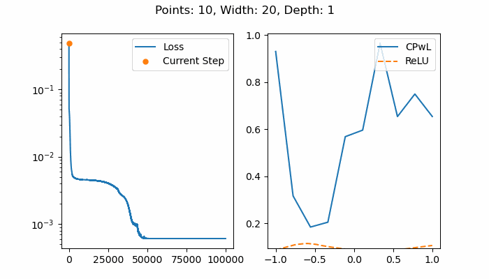

# Deep ReLU Nets

Some experiments with deep ReLU neural networks.

## Installation

You should have a Python 3 environment and the following packages:  
1. Pytorch (1.8.0+cpu is sufficient). See: https://pytorch.org/get-started/locally/.
2. Matplotlib. `pip install "matplotlib>=3.4.0"`

Run the experiment using:

```
python run.py
```

## Initial Results

### Single Layer Network

A ReLU network of width W and a single hidden layer should be able to express any continuous piecewise linear function (CPwL) with W breakpoints [[1]](#References). There is no guarantee, however, that training such a network will produce this result. For instance, here, some of the breakpoints are not in the correct locations to produce the linear spline function. So the training is likely stuck in a local minimum.



## References

[1] Ingrid Daubechies, Ronald A. DeVore, Simon Foucart, Boris Hanin and Guergana Petrova, "Nonlinear Approximation and (Deep) ReLU Networks", CoRR, 2019, http://arxiv.org/abs/1905.02199