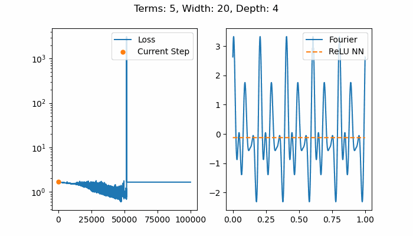

# Deep ReLU Nets

Some experiments using deep [ReLU](https://en.wikipedia.org/wiki/Rectifier_(neural_networks)) neural networks to approximate one dimensional functions.

## Installation

You should have a Python 3 environment and the following packages:  
1. Pytorch (1.8.0+cpu is sufficient). See: https://pytorch.org/get-started/locally/.
2. Matplotlib. `pip install "matplotlib>=3.4.0"`

The experiments are structured as unit tests. To run all tests use:
```
python -m unittest discover test "*.py"
```

Running all tests will most likely take several hours. To run just one: 
```
python -m unittest test/example.py
```

## Initial Results

### Single Layer Networks

A ReLU network of width W and a single hidden layer should be able to express any continuous piecewise linear function (CPwL) with W breakpoints [[1]](#References). There is no guarantee, however, that training such a network will succeed and produce this result.

For instance, here we see that not enough breakpoints form in order to produce a random linear spline function with ten knots. Adding neurons can help. The best fitting model from this set of results was from using width 13. Since the training process is non-deterministic, this is most likely due to chance. 


### Multi Layer Network

Using deep networks allows us to approximate more interesting functions. In this case though, the training is still unstable. At depth four, the training fails altogether and the ReLU network eventually outputs a constant zero. The function being approximated in these examples is a Fourier series with five terms and randomized coefficients.




### Analysis

I suspect the training failure in both the single layer and deep network cases is due to dead neurons [[2]](#References). If the input to a given neuron becomes less than zero for all of the training data, then its ReLU function will always output zero. This can be corrected by using a smaller learning rate but that comes at a cost since more training steps would be needed.

## References

[1] Ingrid Daubechies, Ronald A. DeVore, Simon Foucart, Boris Hanin and Guergana Petrova, "Nonlinear Approximation and (Deep) ReLU Networks", CoRR, 2019, http://arxiv.org/abs/1905.02199

[2] Lu Lu, Yeonjong Shin, Yanhui Su, George Em Karniadakis, "Dying ReLU and Initialization: Theory and Numerical Examples", reprint, 2019, https://arxiv.org/abs/1903.06733
